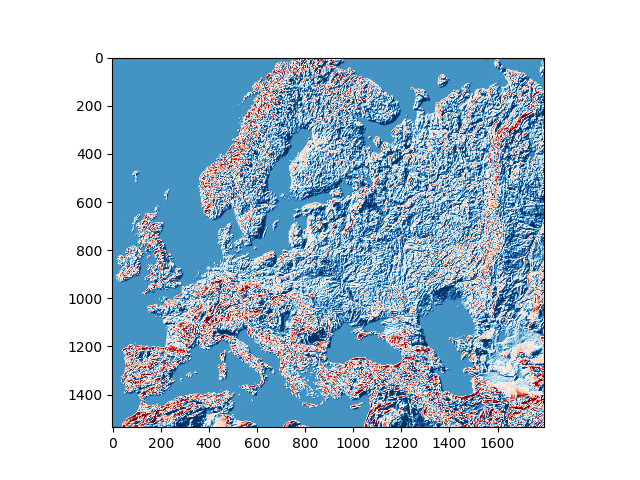

# About the Project
### Our Problem
Perform an analysis of data containing information on terrain elevation differences by selecting groups of areas with the highest increases (continent: Europe). The elevation increase in a given location should be measured based on at least 10 measurement points. Determine 5 groups of areas based on the average elevation increase values. Please plot the detected regions on a map.
### Requirements
* Technology used: EMR/Spark
* Python (libraries)
```
sc.uninstall_package('pip')
sc.install_pypi_package("pip==22.2.2")
sc.install_pypi_package("opencv-python")
sc.install_pypi_package("numpy")
sc.install_pypi_package("matplotlib")
```


# Code

### Overall idea
1. Download of necessary data from the database
2. Sorting data by coordinates
3. Calculating the altitude of every point
4. Calculating the altitude change trend
5. Presenting data on the map
#### Functions
1. **cordToTileIndex** transforms geographic coordinates (latitude and longitude) into tile indices for a specific zoom level on a map
2. **getData** allows for determining an area on a map using geographic coordinates and then retrieves map tile data from that area based on a specified zoom level
3. **getElevation** function is used to process elevation data from map tile pixels, and the **displayMap** function is used to display a map composed of these map tiles
4. **getSlopes** processes elevation data in the form of images, calculates horizontal and vertical gradients using Sobel operators, and then computes terrain slopes based on these gradients.
5. **generateThresholds** generates a set of thresholds based on the average pixel value, and the **applyThresholds** function uses these thresholds to assign different categories to pixels in the input data. This is useful for us, to segment images based on pixel brightness
6. **applyColors** This function takes pixel data and a set of thresholds. It parallelizes pixels into an RDD (Resilient Distributed Dataset) using SparkContext.
Maps thresholds to each element of RDD using 'map', attempting to assign colors to pixels in the input data based on the thresholds.
Finally, it collects the mapping results and returns them.
7. **extractX/YCoordinate** is used to extract the X index from a file name or path and convert it to an integer
# Results

# Authors
* Maciej Rogowicz
* Mateusz Łangowski
